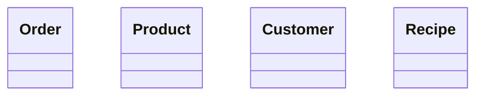
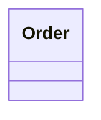

# Programming 6 - The domains of B-MaC

This document describes the 3 identified bounded contexts of B-MaC.

## Store

Customers use the Store to order the products. Its responsibilities are accepting new orders and cancellations before the cutoff time, awarding loyalty points, and finally, forwarding the order line to the Factory.

Store Managers can manipulate the offering, creating or removing products.

Customers can submit a new recipe, that the Store Manager receives and decides to create a new product for it or not.

### Model

### Glossary

cutoff time
customer
store manager
recipe

---

## Factory

After the cutoff time, the Factory receives the orders the Store collected during the day.

---

## Warehouse

### **Model**

### **Glossary**

| Concept        | Definition | Synonyms                 | Remarks                    |
|----------------|------------|--------------------------|----------------------------|
| Delivery       |            |                          |                            |
| Inbound order  |            |                          |                            |
| Item           |            | Ingredient               |                            |
| Outbound order |            |                          |                            |
| Shipment       |            |                          |                            |
| Stock          |            |                          |                            |
| Supplier       |            |                          |                            |
| Volatility     |            | Item volatility          |                            |
| Expiry         |            | Item expiry, expiry date | Can be n/a, e.g. for sugar |
| Position       |            |                          |                            |

