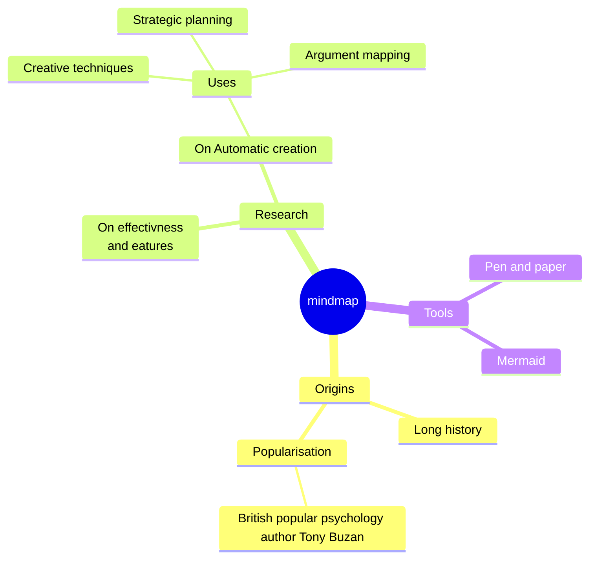

# Programming 6 - Events and commands of the B-MaC contexts

| Event    | Sender   |          |
| -------- | -------- | -------- |
| Text     | Text     | Text     |

```mermaid
mindmap
  root((mindmap))
    Origins
      Long history
      ::icon(fa fa-book)
      Popularisation
        British popular psychology author Tony Buzan
    Research
      On effectivness<br/>and eatures
      On Automatic creation
        Uses
            Creative techniques
            Strategic planning
            Argument mapping
    Tools
      Pen and paper
      Mermaid
```

